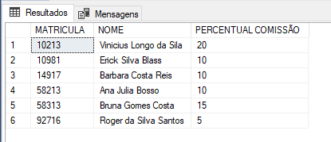

<h1 align= "center">Banco de Dados SQL Server 2019 🗄️</h1>

## TABELA DE PRODUTOS

## TABELA DE VENDEDORES

## TABELA DE CLIENTES

<h2>Tecnologias Usadas:</h2>
<table>
<tr>
<td>SQL</td>
<td>SQL Server 2019</td>
<td>Microsoft SQL Server Management Studio 18</td>
</tr>
